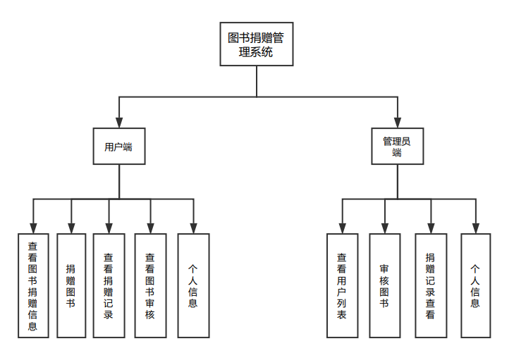
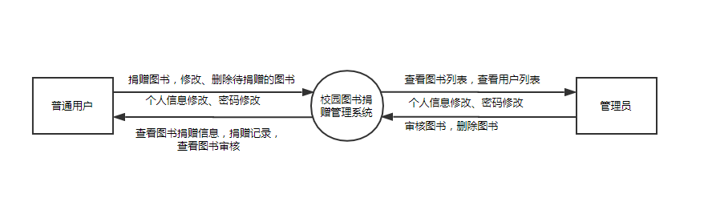
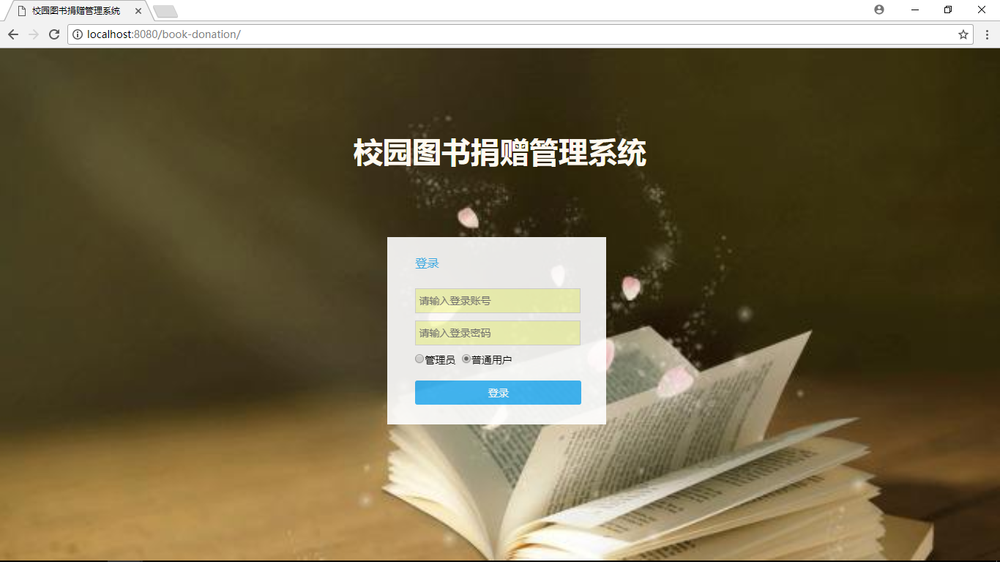
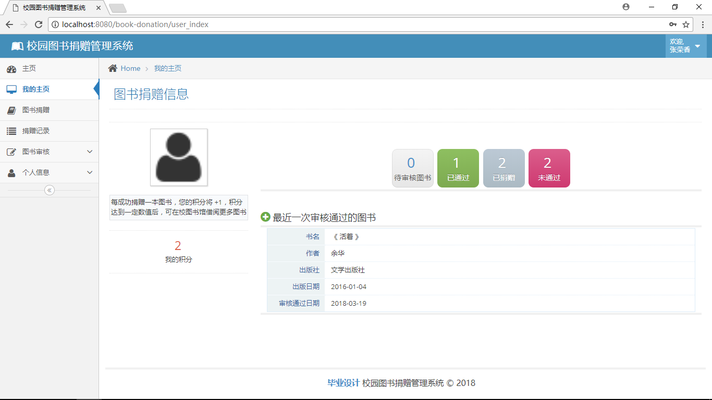
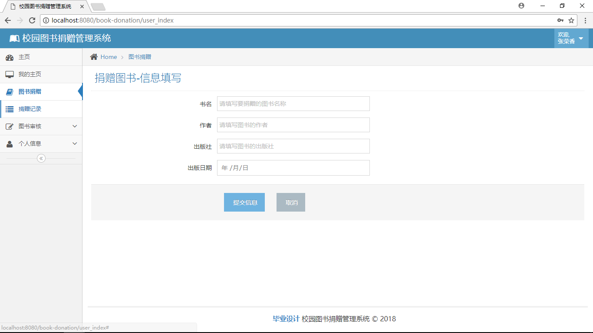
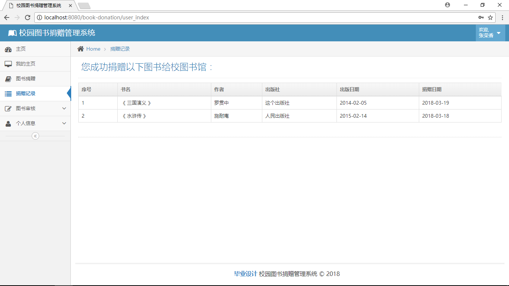
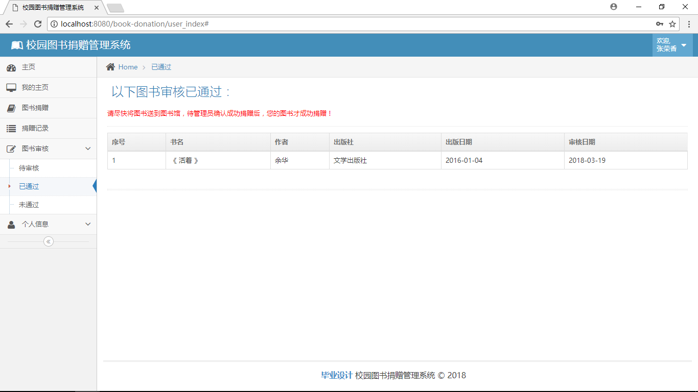
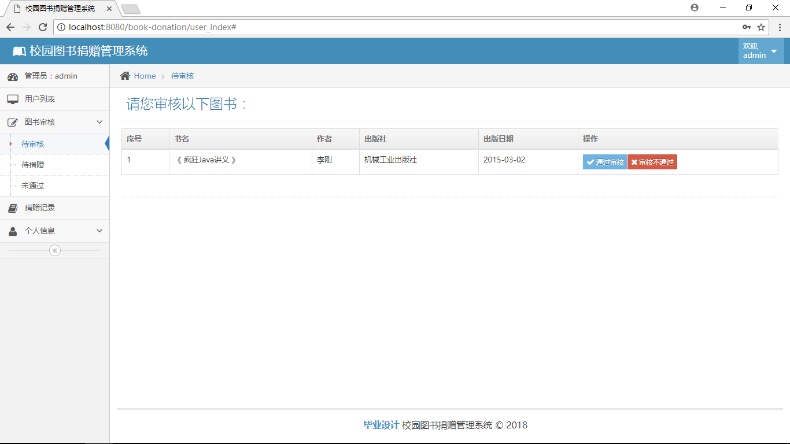
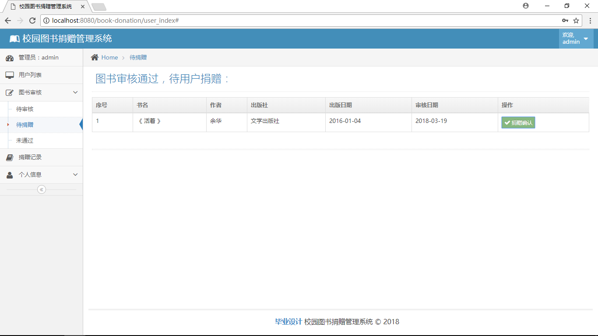

# 校园图书捐赠管理系统
## 项目介绍
&emsp;&emsp;毕业设计成果，18年3月份做的。用SSM（Spring+SpringMVC+MyBatis）框架写的一个图书捐赠管理系统，包括用户端和管理员端。前端模板框架使用的是ace-admin，数据库使用MySQL。该系统虽然分了两个用户角色（用户端/管理员端），但是业务逻辑非常简单，还是比较适合学习SSM的同学们。
## 系统预览
- 预览地址：http://120.27.237.228:8080/book-donation/
- 管理员-账号/密码：  admin/admin
- 普通用户-账号/密码：zrx/666
## 项目部署
**第1步：clone项目到本地**  
**第2步：数据库导入**  
&emsp;&emsp;数据库文件(book_donation.sql)在book-donation/docs/下，将数据库导入到你的本地。  
**第3步：项目导入**  
&emsp;&emsp;开发工具IDEA或Eclipse均可。  
&emsp;&emsp;作为maven项目导入，导入期间需要下载相关依赖包，可能会比较慢，成功导入后，看项目是否正常无报错(我之前用的eclipse开发的该项目，然后又重新导到idea中，部署运行时相应类注入失败，用eclipse需要打一次包，之后再在idea中部署运行项目才可以)。  
**第4步：修改配置文件**  
&emsp;&emsp;修改MySQL数据库连接文件(book-donation/src/main/resources/jdbc.properties)，将账号及密码改为你自己的。  
**第5步：部署运行**  
&emsp;&emsp;在你的本地tomcat部署运行，访问地址：`项目名/login.jsp`  
## 功能介绍
### 系统总体结构设计

### 管理员端功能
- 查看用户列表
- 查看、修改、删除待审核的图书
- 查看待用户捐赠的图书
- 查看未通过审核的图书
- 查看捐赠记录
- 信息查看、信息修改、密码修改
### 用户端功能
- 用户登录
- 查看图书捐赠信息
- 捐赠图书
- 查看图书捐赠记录
- 查看待审核的图书
- 查看已通过审核的图书
- 查看未通过审核的图书
- 信息查看、信息修改、密码修改

### 图片展示

## 联系作者
- Name:Rachel Zhang
- Email:zrxjuly97@163.com